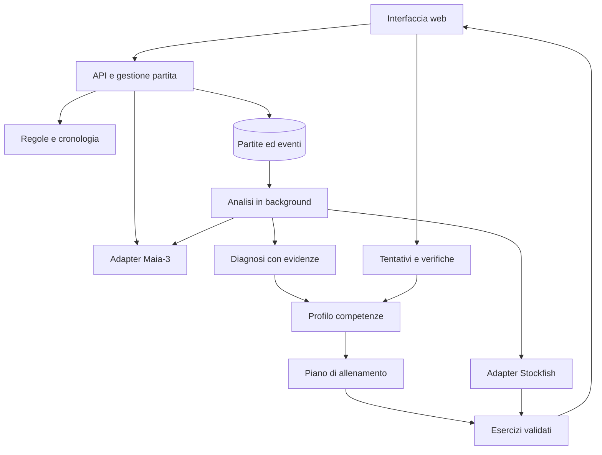

# Chess Coach — progetto di applicazione con Maia e Stockfish

Specifica funzionale e tecnica · 23 settembre 2026 · versione 1.2 — motore browser ufficiale già pronto

**Aggiornamento operativo:** su indicazione dell'utente, la base iniziale è ora il modello `maia3_simplified.onnx` scaricato direttamente da maiachess.com, con worker JavaScript e ONNX Runtime Web/WebAssembly originali. Questo sostituisce la scelta iniziale di un checkpoint Python 5M e dell'inferenza Python come percorso obbligatorio nelle sezioni 2, 4, 6 e 15: quei percorsi restano alternative successive. Non servono addestramento o conversioni. Il tutor utilizzerà la policy del frontend; Stockfish e il sistema didattico mantengono i rispettivi ruoli. I dettagli aggiornati sono nel [documento sul motore browser](https://github.com/dvitale/generic_projects/blob/main/chess-coach/docs/motore-browser.md).

Il pacchetto è stato scaricato localmente, verificato tramite SHA-256 e caricato con il runtime WebAssembly originale in Node.js. Non sono ancora state eseguite partite o verifiche dell'intera applicazione. I riferimenti a motori non eseguiti nel progetto originario distinguono questa verifica di caricamento dall'esecuzione scacchistica completa.

**Obiettivo:** realizzare un'applicazione ispirata alle funzioni di Maia Chess, estendibile, che colleghi partite di allenamento, diagnosi delle difficoltà, esercizi personali e verifica dei progressi.

**Scelta proposta aggiornata:** Maia-3/Chessformer come primo sparring partner, Stockfish come valutatore e verificatore, un modulo didattico indipendente come tutor. Il riferimento principale è il repository `CSSLab/maia3` precisato dall'utente. Maia-3 usa un Transformer: questa proposta sostituisce la precedente baseline CNN; Maia originale resta un adapter facoltativo se si desidera conservare anche quella famiglia di modelli.

Questo documento è un progetto da implementare. Sono stati esaminati sito, paper, repository e alcuni file critici; non sono stati avviati i motori né effettuati benchmark. Soglie, tempi e algoritmi didattici indicati di seguito sono proposte iniziali da validare, non risultati sperimentali.

## 1. Cosa emerge dai link

### Piattaforma Maia Chess

Il sito offre gioco, analisi, puzzle e drill; il punto di partenza utile è l'integrazione fra gioco umano plausibile e analisi. La personalizzazione longitudinale descritta in questo documento è il componente da progettare e verificare. [Sito Maia Chess](https://www.maiachess.com/).

Il frontend pubblico usa Next.js, TypeScript e Tailwind. Ho esaminato il commit `a6e52f5c811ee18863cb2f0e81f2433a5b9905de`. È una base di riferimento utile, ma clonarlo non produce automaticamente una piattaforma autonoma. [Repository frontend](https://github.com/CSSLab/maia-platform-frontend).

Tre riscontri diretti sul codice:

- `src/lib/engine/maia.ts` contiene inferenza Maia-3, maschera delle mosse legali e probabilità normalizzate. Il README descrive ancora anche modelli precedenti: per il progetto conta la versione effettiva del codice. [Implementazione Maia](https://github.com/CSSLab/maia-platform-frontend/blob/a6e52f5c811ee18863cb2f0e81f2433a5b9905de/src/lib/engine/maia.ts).
- `public/maia-worker.js` esegue ONNX fuori dal thread dell'interfaccia e conserva il modello in IndexedDB. [Worker Maia](https://github.com/CSSLab/maia-platform-frontend/blob/a6e52f5c811ee18863cb2f0e81f2433a5b9905de/public/maia-worker.js).
- `next.config.js` inoltra `/api/*` al servizio `dock2.csslab.ca`. Occorre sostituire quel collegamento con un backend proprio. [Configurazione](https://github.com/CSSLab/maia-platform-frontend/blob/a6e52f5c811ee18863cb2f0e81f2433a5b9905de/next.config.js).

Il modulo Stockfish contiene ricerca per più candidate e conversioni del punto di vista. Alcuni commenti descrivono i segni in modo ambiguo: il nuovo dominio deve dichiarare esplicitamente il colore di riferimento e verificarlo con posizioni note, senza copiare convenzioni implicite. Non è un accertamento di bug eseguibile: è un punto da controllare nell'integrazione. [Modulo Stockfish](https://github.com/CSSLab/maia-platform-frontend/blob/a6e52f5c811ee18863cb2f0e81f2433a5b9905de/src/lib/engine/stockfish.ts).

### Repository indicato dall'utente

Il motore di riferimento è [CSSLab/maia3](https://github.com/CSSLab/maia3), esaminato al commit `1e13597c42d4858b7cfd7cfdae01e297263364b2`. Contiene architettura, preprocessing, caricamento dei pesi e inferenza/UCI; l'applicazione web e il tutor personale sono componenti ulteriori. La struttura esaminata non contiene una pipeline completa di addestramento individuale pronta da attivare.

Al momento dell'analisi iniziale, `dvitale/generic_projects` risultava pubblico e vuoto: l'API dei contenuti restituiva “This repository is empty”. Non conteneva un'applicazione Maia da analizzare o estendere. È il repository scelto per ospitare questo progetto nella sottocartella `chess-coach/`. [Repository](https://github.com/dvitale/generic_projects).

### Paper indicato

Il paper è **Chessformer: A Unified Architecture for Chess Modeling**. Presenta un Transformer con caselle come token, Geometric Attention Bias e una testa che collega origine e destinazione delle mosse. Maia-3 è la famiglia destinata alla previsione del gioco umano. Il risultato dichiarato del 57,1% riguarda l'accordo con le mosse umane nel benchmark, non l'efficacia di un tutor. Il miglioramento agonistico di Leela citato nel paper appartiene a un esperimento diverso: non significa che il bot Maia-3 sia più forte di Stockfish. [Paper completo](https://arxiv.org/html/2605.19091v1).

Conseguenza progettuale: usare le previsioni di Maia per interpretare la plausibilità di una scelta; misurare separatamente se gli esercizi producono apprendimento. Mappe di attenzione o attivazioni non devono diventare spiegazioni causali automatiche del ragionamento del giocatore.

## 2. Quale Maia utilizzare

| Opzione | Caratteristica rilevante | Impiego proposto |
|---|---|---|
| Maia originale | CNN; nove pesi associati alle fasce 1100–1900 | Adapter facoltativo per confronto con la famiglia CNN |
| Maia-2 | Modello unico sensibile al livello; attenzione condizionata sull'abilità | Adapter facoltativo per confronti |
| Maia-3 | Transformer Chessformer; modelli di diverse dimensioni | Motore principale della prima versione |

Maia originale distribuisce pesi per Leela Chess Zero; le istruzioni ufficiali indicano `go nodes 1`, disattivando di fatto la ricerca profonda. Il rating del checkpoint identifica i dati di addestramento e non garantisce un'identica forza agonistica. [Maia originale](https://github.com/CSSLab/maia-chess).

Maia-2 incorpora un meccanismo di attenzione sensibile all'abilità; non va trattato come equivalente al vecchio motore CNN. [Paper Maia-2](https://arxiv.org/abs/2409.20553).

Maia-3 espone un motore UCI con opzioni per rating e campionamento; i suoi valori WDL sono previsioni di esiti umani, non valutazioni di ricerca Stockfish. [Repository Maia-3](https://github.com/CSSLab/maia3).

**Decisione:** sviluppare `Maia3Adapter` come implementazione iniziale di `HumanPolicyEngine`. Proposta di baseline: modello 5M su CPU; confronto con 23M e 79M solo dopo aver misurato latenza, memoria e utilità sul caso d'uso. Un modello più grande non rappresenta automaticamente un avversario con Elo più alto: dimensione della rete e rating condizionante sono due parametri distinti.

Il registro ufficiale definisce le configurazioni dei checkpoint. Usare quei preset, evitando di ricostruire manualmente dimensioni e preprocessing. [Registro dei modelli](https://github.com/CSSLab/maia3/blob/1e13597c42d4858b7cfd7cfdae01e297263364b2/maia3/model_registry.py).

## 3. Esperienza del giocatore

Assunzioni iniziali: applicazione web in italiano, esecuzione locale possibile, un utente nella prima versione, partite standard, importazione PGN e sessioni di allenamento da 15–30 minuti. Servizi multiutente e connessione Lichess arrivano dopo il ciclo didattico essenziale.

### Le cinque schermate

| Schermata | Contenuto | Azione principale |
|---|---|---|
| Oggi | Obiettivo del giorno, motivazione, durata, ripassi dovuti | Avvia sessione |
| Gioca | Scacchiera, mosse, orologio, livello Maia, modalità | Gioca una partita o una posizione |
| Rivedi | Tre momenti istruttivi, varianti, scelta personale e alternative | Riprova prima di vedere la soluzione |
| Allenati | Puzzle personali, posizioni nuove e finali da giocare | Completa l'esercizio |
| Progressi | Opportunità, errori ricorrenti, verifiche senza aiuti, incertezza | Esamina le prove di un miglioramento |

La schermata di revisione mette la scacchiera al centro; accanto compaiono la domanda del tutor e una breve spiegazione. Varianti lunghe e statistiche sono espandibili. Su telefono scacchiera e tutor si dispongono in verticale. Nessun indice globale di “bravura” calcolato con pesi opachi.

### Tre modalità distinte

1. **Partita libera:** Maia gioca normalmente. Il tutor raccoglie eventi ma offre feedback alla fine. È la modalità più utile per osservare decisioni spontanee.
2. **Partita guidata:** suggerimenti graduali su richiesta: domanda, indizio, mossa candidata, variante. Ogni aiuto è registrato; le scelte assistite non contano come prova indipendente di padronanza.
3. **Allenamento mirato:** partenza da una posizione scelta per una competenza. Può includere risposte didattiche selezionate. La sessione è marcata come esercizio, poiché modifica la distribuzione del gioco naturale.

Il bot può essere avversario e il prodotto può essere tutor contemporaneamente, ma i due compiti hanno obiettivi diversi e moduli separati.

## 4. Architettura proposta

Partire da un **backend modulare con worker per i motori**, evitando una costellazione di microservizi nella prima versione.



| Componente | Tecnologia proposta | Responsabilità |
|---|---|---|
| Web | React/Next.js, TypeScript, componente scacchiera isolato | Gioco, revisione, esercizi, progressi |
| API | Python, FastAPI, schemi Pydantic | Casi d'uso, autorizzazione, dati e regole |
| Regole | python-chess | Legalità, PGN, storia e comunicazione UCI |
| Motore umano | Worker Python/PyTorch con Maia-3; UCI per interoperabilità | Distribuzione completa delle mosse e scelta del bot |
| Valutazione | Processo Stockfish nativo | Analisi, varianti e controllo degli esercizi |
| Worker | Processo Python separato, coda persistente nel database | Analisi differita, timeout, retry, priorità |
| Archivio | PostgreSQL; file PGN e modelli su volume locale | Dati versionati, eventi e artefatti |
| Tutor | Regole esplicite e template; generazione linguistica opzionale | Diagnosi, selezione didattica, spiegazione |

Queste sono scelte di progetto, non una descrizione del backend originale. Versioni e immagini saranno fissate dopo la prova di integrazione.

**Perché motori nativi all'inizio:** facilitano il riuso dell'inferenza Python ufficiale, l'accesso alla policy completa, l'analisi riproducibile e i lavori persistenti. Maia-3 non richiede lc0 per questo percorso. Un browser chiuso non deve interrompere l'aggiornamento del piano. L'interfaccia resta web; il backend può girare sullo stesso computer.

**Evoluzione browser:** Maia ONNX e Stockfish WASM come adapter opzionali, con benchmark e test di equivalenza rispetto al percorso nativo. Usare worker dedicati e una sola analisi attiva per istanza; verificare i requisiti di isolamento del browser per il multithreading. Nessuna conversione dei pesi è data per funzionante senza confronto numerico.

## 5. Contratti che permettono di estendere il prodotto

Le seguenti interfacce sono nuove, non API già esistenti nei repository Maia.

```text
HumanPolicyEngine.predict(position_context, player_context) -> PolicyResult
HumanPolicyEngine.choose_move(policy, sampling_config) -> MoveDecision
PositionEvaluator.analyze(position_context, candidates, budget) -> EvaluationBatch
ConceptDetector.detect(position_context, evaluations) -> Evidence[]
LearnerModel.update(profile, observation) -> ProfileRevision
CurriculumPolicy.plan(profile, available_minutes, exercise_pool) -> TrainingPlan
ExerciseGenerator.generate(evidence, constraints) -> ExerciseDraft[]
ExerciseValidator.validate(draft, budget) -> ValidatedExercise | Rejection
ExplanationProvider.explain(evidence_bundle, verbosity) -> Explanation
```

`PositionContext` contiene FEN iniziale, lista delle mosse UCI, FEN corrente, variante e hash della storia. Una FEN corrente isolata non conserva tutte le informazioni sulle ripetizioni né il percorso della partita. Conservare la storia anche quando un particolare modello non la usa.

`PolicyResult` contiene mosse legali e probabilità, identificatore del modello, hash dei pesi, preprocessing, fascia richiesta ed effettiva, eventuale stato di dati fuori dominio. Le probabilità provengono dalla rete: il solo `bestmove` UCI non basta.

`EvaluationBatch` contiene colore di riferimento, candidate, punteggi centipawn o matto distinti, WDL se disponibili, varianti, nodi, profondità, limiti inferiori/superiori, versione del motore e stato provvisorio/confermato. Non mescolare risultati incompatibili in una stessa revisione.

Ogni strategia didattica è registrata per nome e versione. Aggiungere un nuovo rilevatore di finali o cambiare lo scheduler non deve richiedere modifiche a Maia né alla scacchiera.

## 6. Integrazione pratica dei motori

### Maia-3: integrazione del repository ufficiale

Il pacchetto usa PyTorch, python-chess e Hugging Face Hub; espone comandi per UCI e cache dei modelli. [Metadati del pacchetto](https://github.com/CSSLab/maia3/blob/1e13597c42d4858b7cfd7cfdae01e297263364b2/pyproject.toml).

Due percorsi nella stessa integrazione:

- **Gioco:** UCI ufficiale o selezione da policy nel worker; compatibilità verificata sulle stesse posizioni.
- **Tutor:** inferenza diretta con maschera delle mosse legali e distribuzione completa, tramite una piccola estensione controllata del codice ufficiale.

Riscontro importante: `score_moves()` calcola la policy, ma limita l'elenco restituito a `MultiPV`; `cmd_go()` stampa mosse e valori WDL/CP senza le probabilità di policy. Aumentare MultiPV non offre quindi un'API di probabilità completa. L'adapter deve esporre i logits mascherati o la distribuzione normalizzata prima del troncamento. Inoltre la funzione seleziona già una mossa casuale: separare la sola predizione dalla selezione evita che una richiesta di analisi consumi lo stato casuale del bot. [Inferenza e protocollo UCI](https://github.com/CSSLab/maia3/blob/1e13597c42d4858b7cfd7cfdae01e297263364b2/maia3/uci.py).

Configurazione di progetto:

- Worker persistente con checkpoint precaricato, accessi serializzati o batch espliciti; nessun caricamento a ogni mossa.
- Ricostruire la cronologia dal PGN. Nel percorso UCI abilitare `--use-uci-history`: nel codice esaminato è disabilitato per default e, senza questa opzione, la posizione corrente riempie la storia del modello. Usare il preprocessing ufficiale per orientamento e padding.
- Nel turno del bot, `SelfElo` rappresenta il bot e `OppoElo` l'utente; per analizzare una decisione dell'utente rappresentano rispettivamente utente e avversario. Scambiare i ruoli quando cambia il giocatore che muove.
- Conservare separatamente policy originale e distribuzione usata per il campionamento. Temperatura e TopP non devono alterare le probabilità mostrate dal tutor come output originale della rete.
- Baseline di verifica con temperatura zero; gioco vario con campionamento configurato, seed e stato casuale per partita. Non promettere una forza agonistica uguale al parametro Elo.
- Non trasferire a Maia-3 le convenzioni di ricerca di lc0: il percorso esaminato effettua inferenza, non una ricerca profonda regolabile come Stockfish.
- Dichiarare il dominio validato dei rating: i limiti numerici accettati dall'opzione UCI non sono prova di calibrazione sull'intero intervallo.
- Fissare commit del codice, revisione dei pesi e checksum. Gestire download e cache prima dell'avvio della sessione.

Le proprietà della cronologia, del campionamento e dei ruoli Elo sopra indicate derivano dalla lettura dell'[implementazione fissata](https://github.com/CSSLab/maia3/blob/1e13597c42d4858b7cfd7cfdae01e297263364b2/maia3/uci.py); la loro integrazione nell'app deve ancora essere eseguita e verificata.

### Stockfish

- Analisi iniziale economica; approfondimento delle posizioni candidate a diventare lezioni.
- Valutare sempre la mossa giocata, anche se assente dalle prime varianti. Includere mosse Stockfish, candidate Maia e la mossa del giocatore.
- Usare ricerche ristrette alla mossa dalla stessa radice per confronti omogenei; rivalutare se la presunta alternativa migliore risulta peggiore della scelta giocata per rumore di ricerca.
- Gestire timeout, cancellazione e coda per istanza. Separare la capacità riservata al gioco dai lavori di analisi in massa.
- Normalizzare ogni risultato sul colore del giocatore che prendeva la decisione. `python-chess` espone esplicitamente `PovScore.pov(color)` e `PovWdl.pov(color)`. [Documentazione](https://python-chess.readthedocs.io/en/latest/engine.html).

Se disponibili, usare WDL native del motore fissato. Per un risultato normalizzato `Q = P(vittoria) + 0,5 × P(patta)`, definire perdita di qualità `L = max(0, Q_migliore − Q_giocata)`. È un indicatore del motore, non la probabilità personale di vittoria: la calibrazione Stockfish deriva dal suo contesto di partite fra motori. [Documentazione WDL](https://official-stockfish.github.io/docs/stockfish-wiki/Useful-data.html).

Matto, perdita di materiale e obiettivi specifici del finale restano segnali separati: il solo WDL può saturare in posizioni già perse. Se il budget non consente una conferma, mostrare “da verificare” e non pubblicare un puzzle con soluzione certa.

## 7. Dalla partita a una diagnosi utilizzabile

### Pipeline

1. Validare il PGN e ricostruire la partita. Registrare errori di importazione, tempi disponibili e provenienza.
2. Selezionare le decisioni del giocatore; distinguere mosse forzate, già assistite o ripetute.
3. Calcolare le candidate Maia e la valutazione Stockfish con le rispettive versioni.
4. Individuare i momenti critici e approfondirli prima di attribuire etichette didattiche.
5. Applicare rilevatori di concetti con prove verificabili.
6. Raggruppare gli errori conseguenti allo stesso episodio: una forchetta subita e le successive perdite non sono cinque carenze indipendenti.
7. Aggiornare il profilo contando anche le opportunità riuscite.
8. Proporre al massimo tre momenti di revisione e uno o due obiettivi prioritari.

### Tre informazioni diverse per ogni decisione

| Informazione | Fonte | Significato |
|---|---|---|
| Qualità della mossa | Stockfish, budget dichiarato | Conseguenza scacchistica stimata |
| Plausibilità umana | Policy Maia | Quanto il modello associa quella scelta alla fascia selezionata |
| Evidenza di una difficoltà personale | Partite ed esercizi del giocatore | Ricorrenza osservata in un contesto preciso |

Una buona mossa rara resta buona. Una cattiva mossa frequente nella policy resta un errore. La probabilità Maia non dimostra quale ragionamento abbia fatto l'utente. Il tutor può chiedere “quale risposta avevi considerato?” per raccogliere evidenza aggiuntiva.

Come segnale ausiliario, si può stimare la massa Maia sulle candidate sbagliate. Se è stata analizzata solo una parte delle mosse, restituire un intervallo: somma delle probabilità degli errori verificati come limite inferiore; stessa somma più la massa non analizzata come limite superiore. Non rinormalizzare il sottoinsieme facendo credere di avere la distribuzione completa. Non presentarlo come rischio individuale calibrato.

### Tassonomia progressiva

**Prima versione:** minaccia immediata non parata; pezzo perso per cattura verificata; attacco doppio; inchiodatura tatticamente rilevante; matto breve; opportunità tattica mancata. Ogni rilevatore restituisce mosse, pezzi e variante che sostengono la classificazione.

**Seconda versione:** sviluppo e sicurezza del re, gestione dei cambi, finali elementari, conversione di vantaggio. Questi temi richiedono regole più contestuali o esercizi revisionati.

**Ricerca successiva:** pianificazione posizionale, stile, strutture pedonali e spiegazioni più sottili. Usare etichette provvisorie e revisione umana, non certezze ricavate da un solo calo di valutazione.

Esempio: “pezzo non difeso” non significa automaticamente “pezzo in presa”. Una cattura può essere impossibile o perdere per una combinazione. Per attribuire l'errore, il motore deve confermare la conseguenza. Se sono presenti più temi, distinguere tema principale e temi secondari senza moltiplicare il peso dello stesso episodio.

### Prima evidenza, poi diagnosi

Regola operativa iniziale, da calibrare: per presentare una difficoltà come ricorrente, richiedere opportunità distribuite su almeno tre partite e almeno dieci osservazioni pertinenti. Sotto questa soglia mostrare “ipotesi da verificare”, e proporre un breve test. La soglia evita conclusioni premature ma non garantisce da sola affidabilità statistica.

Il tempo di riflessione va interpretato rispetto al tempo residuo e all'incremento. Se un PGN non contiene gli orologi, il sistema non deve dedurre che un errore sia stato causato dalla fretta.

## 8. Modello del giocatore

Per ogni competenza conservare:

- opportunità osservate, successi ed errori verificati;
- gravità media degli errori e distribuzione dei contesti;
- difficoltà delle posizioni e risultati senza suggerimenti;
- separazione fra partita libera, guidata, esercizi e test;
- colore, fase della partita e cadenza;
- ultima evidenza, ultimo ripasso e data della prossima verifica;
- attendibilità della diagnosi e riferimenti alle prove.

Il primo modello può essere una stima regolarizzata delle frequenze per competenza e contesto. Non chiamarla probabilità di padronanza finché non è calibrata su dati indipendenti. Le ripetizioni della stessa posizione hanno peso limitato; gli esercizi selezionati apposta su una debolezza non vanno aggregati senza correzione con il gioco spontaneo.

Separare tre obiettivi:

1. **Personalizzare il percorso:** possibile subito, con regole e dati osservati.
2. **Personalizzare il livello del bot:** aggiornare il rating condizionante con cautela fra sessioni; mantenere checkpoint e configurazione stabili durante una partita libera.
3. **Imitare esattamente il giocatore:** eventuale addestramento di un modello individuale, successivo e separato.

Non occorre riaddestrare Maia per produrre il primo piano personalizzato. Un modello che imita meglio le scelte dell'utente può anche imitarne meglio gli errori: non è automaticamente un insegnante migliore.

Per sperimentare adattamento neurale: consenso separato, mosse del giocatore realmente non assistite, partite di validazione cronologicamente successive, confronto con il modello generico, controllo di sovradattamento e rollback. Escludere le mosse del bot e contrassegnare quelle umane giocate contro il bot, perché rappresentano un contesto diverso dalle partite contro persone. La quantità necessaria di dati dipende dall'esperimento: non promettere un clone personale dopo un numero fisso di partite.

## 9. Piano di allenamento e selezione degli esercizi

Una priorità iniziale trasparente può combinare, dopo normalizzazione:

`priorità = frequenza delle opportunità × tasso di errore regolarizzato × gravità × affidabilità`

Aggiungere un budget separato per ripassi e per esplorare aree poco osservate, altrimenti il sistema allena soltanto ciò che conosce già. La priorità è una regola di ordinamento da confrontare con alternative; non è una misura scientifica di apprendimento atteso.

Vincoli del piano:

- rispettare il tempo giornaliero scelto;
- concentrarsi su uno o due temi;
- alternare riconoscimento, scelta della mossa e applicazione in partita;
- inserire ripassi già dovuti;
- mantenere alcune prove nuove e senza aiuti;
- spiegare il motivo di ogni esercizio con riferimento alle evidenze.

Come obiettivo iniziale di difficoltà, cercare esercizi risolvibili autonomamente in circa il 60–80% dei casi. È una scelta di prodotto da validare. In assenza di dati, partire da esercizi graduati e aggiornare la difficoltà dai tentativi; non usare la probabilità Maia della soluzione come probabilità personale di successo.

### Esempio illustrativo di sessione da 25 minuti

| Attività | Minuti | Obiettivo |
|---|---:|---|
| Ripasso di due situazioni note | 4 | Recuperare il procedimento |
| Tre esercizi nuovi sulle minacce avversarie | 6 | Trasferire il concetto |
| Posizione da continuare contro Maia | 10 | Applicarlo durante il gioco |
| Revisione e breve verifica | 5 | Raccogliere evidenza senza aiuti |

È un esempio di funzionamento, non un piano basato sulle tue partite, che non sono ancora disponibili.

### Ripetizione e verifica

Baseline proposta: ripassi dopo 1, 3, 7, 14 e 30 giorni, adattati a successo, tempo e indizi. Una risposta vista pochi secondi prima non vale come recupero autonomo. Dopo un errore, spiegazione immediata e nuova prova differita; dopo un successo, alternare stessa posizione e posizioni sullo stesso tema.

Prevedere un'interfaccia `ReviewScheduler` per sostituire la sequenza iniziale con uno scheduler stimato sui dati senza cambiare esercizi e interfaccia.

## 10. Generazione e validazione degli esercizi

### Quattro famiglie

| Famiglia | Origine | Uso |
|---|---|---|
| Riprova la tua decisione | Posizione precedente a un errore | Riconoscere il problema personale |
| Stesso tema, nuova posizione | Raccolta curata o posizioni validate | Verificare trasferimento |
| Continua da qui | Partita dell'utente o posizione didattica | Allenare una sequenza di decisioni |
| Difendi o converti | Finale o vantaggio selezionato | Allenare obiettivi oltre la tattica |

Pipeline di pubblicazione:

1. Ricostruire posizione, turno, diritti di arrocco, en passant e storia disponibile.
2. Verificare la presenza effettiva del tema e la legalità delle varianti.
3. Analizzare soluzione e alternative con budget superiore allo screening.
4. Per puzzle a risposta unica, esaminare tutte le alternative legali e richiedere margine e stabilità. Se il budget non basta o due soluzioni sono equivalenti, accettare più mosse oppure scartare il formato a risposta unica.
5. Conservare difese critiche: una linea che funziona soltanto contro la risposta più probabile di Maia non basta come soluzione corretta.
6. Generare indizi graduati da fatti verificati.
7. Deduplicare per posizione, storia rilevante e tema; separare le famiglie di posizioni fra allenamento e test.
8. Salvare certificazione dell'analisi, versione del validatore e condizioni di rivalutazione.

La certificazione è una verifica entro un budget, non una prova matematica per ogni posizione. Per finali compatibili si possono aggiungere tablebase come fonte esatta, rispettandone le condizioni.

Negli esercizi interattivi Maia può scegliere risposte plausibili; Stockfish controlla se una soluzione resta valida contro difese più forti. Non cambiare arbitrariamente pezzi o colori per creare varianti: ogni trasformazione richiede una nuova verifica.

## 11. Tutor e spiegazioni

Il tutor riceve un fascicolo di evidenze strutturato: posizione, mossa del giocatore, alternative accettabili, variante verificata, tema, errore ricorrente e aiuti già usati.

Struttura della risposta:

1. Una domanda che orienti l'attenzione.
2. Il fatto concreto ignorato nella posizione.
3. Una breve variante che lo dimostri.
4. Un criterio riutilizzabile nella prossima partita.
5. Un esercizio collegato.

Esempio di tono, subordinato alla verifica della posizione: “Prima di attaccare, controlla gli scacchi dell'avversario. Qui uno scacco crea un attacco doppio. Prova a trovare una mossa che elimini entrambe le minacce.”

Template deterministici sono sufficienti per la prima versione. Un modello linguistico può in seguito rendere più naturale il dialogo: riceve le evidenze, non inventa mosse né decide da solo se un esercizio è corretto. Le mosse citate devono essere ricostruibili e legali; in caso di risposta non valida si usa il template. Commenti PGN e testo importato restano dati, mai istruzioni operative per il tutor.

La scheda della lezione deve permettere di aprire la prova: “perché mi proponi questo tema?” conduce alle posizioni pertinenti, non a un generico giudizio sullo stile.

## 12. Dati ed eventi

| Entità | Campi principali |
|---|---|
| `PlayerProfile` | preferenze, tempo disponibile, rating dichiarato con fonte e cadenza |
| `Game` | proprietario, PGN, FEN iniziale, fonte, risultato, modalità, configurazione bot |
| `MoveEvent` | partita, ply, UCI, FEN, tempi, attore umano/bot, aiuti, versione posizione |
| `AnalysisRun` | motori, hash pesi, opzioni, budget, stato, data |
| `MoveAssessment` | posizione, candidate, qualità, policy, punto di vista, provenienza |
| `SkillEvidence` | tema, esito, opportunità, affidabilità, episodio e riferimenti |
| `SkillEstimate` | competenza, contesto, stima, numerosità e versione |
| `Exercise` | posizione/storia, tema, soluzioni, indizi, fonte, certificazione |
| `Attempt` | risposte, successo, durata, aiuti, primo tentativo/ripasso |
| `TrainingPlan` | obiettivi, attività, budget, motivazioni, versione del profilo |
| `ReviewSchedule` | elemento, prossima scadenza, storia degli esiti |

Eventi di dominio: `GameFinished`, `AnalysisCompleted`, `EvidenceRecorded`, `ExerciseValidated`, `AttemptCompleted`, `ProfileUpdated`, `PlanRevised`. La catena è idempotente: rielaborare la stessa partita non deve raddoppiare le evidenze.

La chiave della cache di inferenza include modello, preprocessing, posizione e contesto usato dal modello. La cache Stockfish include motore/rete NNUE, storia, impostazioni e budget. Il solo FEN non è una chiave universale sufficiente.

Le revisioni sono conservate: cambiare un classificatore non deve riscrivere silenziosamente i progressi passati. Prevedere una rielaborazione esplicita con nuova versione.

## 13. API e struttura del repository

Endpoint proposti:

| Metodo e percorso | Funzione |
|---|---|
| `POST /v1/games` | Crea partita con colore, cadenza, modello e modalità |
| `POST /v1/games/{id}/moves` | Valida mossa UCI e numero di versione atteso |
| `GET /v1/games/{id}/events` | Aggiornamenti partita tramite SSE |
| `POST /v1/imports/pgn` | Importa con rapporto su errori e duplicati |
| `POST /v1/games/{id}/analyses` | Avvia analisi e restituisce un job |
| `GET /v1/jobs/{id}` | Legge stato, avanzamento ed eventuale errore |
| `GET /v1/me/skills` | Profilo con attendibilità e prove |
| `POST /v1/me/plans` | Genera o aggiorna piano con limite di tempo |
| `GET /v1/exercises/{id}` | Posizione e consegna, senza soluzione anticipata |
| `POST /v1/exercises/{id}/attempts` | Valuta un tentativo e aggiorna evidenze |
| `POST /v1/attempts/{id}/hints` | Concede e registra un indizio |

Le mutazioni accettano una chiave di idempotenza. Una mossa su una posizione superata viene respinta; un job lento non può applicare una risposta a un'altra partita. Autorizzazione per proprietario su tutte le risorse, limiti PGN e limiti di calcolo. In modalità locale il servizio ascolta su loopback; autenticazione e separazione utenti precedono una distribuzione pubblica.

```text
generic_projects/
  chess-coach/
    apps/web/
    backend/
      api/
      domain/
        games/
        analysis/
        learner/
        curriculum/
        exercises/
      adapters/
        maia3/
        stockfish_uci/
        maia1_lc0/        # confronto facoltativo successivo
        explanations/
      workers/
    contracts/
    model-manifests/
    tests/
      fixtures/
      engines/
      pedagogy/
      e2e/
    docs/
    infra/
```

I pesi voluminosi non vanno inseriti nella cronologia Git. Un manifest contiene URL ufficiale, revisione, checksum, licenza, input/output e preprocessing; il download avviene separatamente. Nessun modello remoto viene aggiornato automaticamente durante un esperimento.

## 14. Riutilizzo, distribuzione e dati personali

La scelta iniziale consigliata è un'applicazione propria, con identità visiva propria e componenti selezionati dal frontend solo quando il riuso è conveniente. Un fork completo accelera alcune schermate ma introduce dipendenze e assunzioni da sostituire, a partire dal backend esterno.

Inventario preliminare delle licenze dichiarate dai progetti: frontend Maia e Maia originale GPL-3.0; Stockfish GPL-3.0; Maia-3 AGPL-3.0; Maia-2 MIT. Prima di distribuire una build occorre verificare anche gli specifici pesi, asset e dipendenze inclusi. Non dedurre la licenza dei pesi da quella del solo codice, né presumere che separare processi elimini obblighi di licenza. [Frontend](https://github.com/CSSLab/maia-platform-frontend/blob/main/LICENSE), [Maia originale](https://github.com/CSSLab/maia-chess/blob/master/LICENSE), [Stockfish](https://github.com/official-stockfish/Stockfish/blob/master/Copying.txt), [Maia-3](https://github.com/CSSLab/maia3/blob/main/LICENSE), [Maia-2](https://github.com/CSSLab/maia2/blob/main/LICENSE).

Dati personali: importazione scelta dall'utente, esportazione PGN e profilo, cancellazione degli originali e dei derivati personali, credenziali separate e consenso specifico per eventuale addestramento. Un modello personale deve mantenere il collegamento alla provenienza dei dati e una strategia di rimozione. Il primo prototipo non richiede telemetria esterna.

## 15. Roadmap con criteri di completamento

| Fase | Risultato | Criterio per passare oltre |
|---|---|---|
| 0 — Prova motori | Maia-3 5M e Stockfish sulla stessa serie di posizioni | Mosse legali, policy completa normalizzata, cronologia e prospettiva corrette, tempi e memoria misurati |
| 1 — Ciclo minimo | Gioco → analisi → un esercizio personale → salvataggio tentativo | Percorso completo ripetibile, senza dipendere dal backend Maia pubblico |
| 2 — Profilo e piano | Tre competenze affidabili, ripasso, piano giornaliero | Ogni attività motivata da evidenze; nessun doppio conteggio |
| 3 — Applicazione in gioco | Sparring da posizioni, verifiche nuove, importazioni robuste | Misure separate di memoria, trasferimento e gioco libero |
| 4 — Confronti | Maia-3 23M/79M, eventuale Maia CNN, scheduler alternativi, tutor linguistico opzionale | Beneficio dimostrato rispetto alla baseline e rollback disponibile |

**Perimetro MVP:** Maia-3 5M, Stockfish, import PGN, partite libere e da posizione, revisione dei momenti critici, pochi temi tattici affidabili, esercizi personali, piano e ripassi. Funzioni come broadcast, hand-and-brain, bot-or-not e social non sono necessarie per verificare l'idea.

### Prime attività eseguibili

1. Creare il dominio degli stati di partita e i contratti motore.
2. Esporre la policy completa Maia-3 separando predizione e campionamento, con cronologia e ruoli Elo corretti.
3. Implementare Stockfish con candidate forzate e normalizzazione del punto di vista.
4. Costruire una raccolta di posizioni note e controllare entrambi gli adapter.
5. Implementare importazione, eventi e persistenza senza duplicati.
6. Collegare partita, revisione ed esercizio sul primo tema tattico.
7. Aggiungere altri due rilevatori, il profilo e il piano trasparente.
8. Inserire test nuovi separati dagli esercizi di ripasso.

Non aggiungere subito GPU dedicata, fine-tuning e orchestrazione distribuita. Prima misurare la baseline CPU sull'hardware disponibile. I costi sono dominati da numero di posizioni, candidate e budget di ricerca: usare cache e approfondimento selettivo.

## 16. Verifica tecnica e didattica

### Correttezza tecnica

- Arrocco, en passant, promozioni, scacco, stallo, ripetizioni e regole di patta: comportamento coerente fra interfaccia e backend.
- Policy: solo mosse legali, somma circa uno entro la tolleranza dichiarata, nessuna NaN, gestione esplicita delle posizioni terminali.
- Valutazioni: casi favorevoli a Bianco e Nero, cambi di turno, matto e patta; nessuna inversione accidentale del segno.
- Mossa giocata fuori dalle prime candidate: viene comunque valutata.
- Esercizi: alternative corrette accettate, varianti riproducibili, aiuti registrati, nessuna soluzione dichiarata unica senza controllo delle alternative.
- Operatività: timeout motore, riavvio worker, reconnect, retry, importazione duplicata e analisi cancellata senza perdita o duplicazione degli eventi.

### Prestazioni

Definire un computer di riferimento prima di fissare SLA. Obiettivo provvisorio: risposta del bot già caricato entro circa un secondo al 95° percentile; analisi approfondita asincrona, con risultati parziali esplicitamente marcati. Misurare separatamente caricamento iniziale, inferenza, ricerca, memoria e coda. Nessun tempo di elaborazione è stato misurato in questa analisi.

Per riproducibilità conservare seed del campionamento, hash degli artefatti, hardware, numero di thread e budget. Per i confronti del motore usare condizioni fissate; una valutazione multi-thread non è necessariamente identica fra esecuzioni.

### Efficacia dell'allenamento

Metriche principali:

- errori per opportunità pertinente, suddivisi per difficoltà e contesto;
- successo al primo tentativo senza aiuti su posizioni nuove;
- mantenimento a distanza di giorni;
- riduzione della stessa classe di errore in partite libere;
- precisione delle diagnosi e validità degli esercizi su un campione revisionato da un istruttore.

Il rating e la percentuale di vittorie contro il bot sono secondari: cambiano anche con avversario, repertorio e cadenza. Un piano non è efficace solo perché l'utente completa molti puzzle.

Confrontare percorso personalizzato e percorso generico con uguale tempo di studio, difficoltà comparabile e prove non viste. Per un solo utente si può iniziare con periodi e temi bilanciati, dichiarando i limiti; per più utenti utilizzare un confronto controllato. Separare cronologicamente i dati e raggruppare posizioni simili per evitare che una quasi-copia del training finisca nel test.

## 17. Decisione finale di progetto

Il componente distintivo da costruire è il ciclo **osservazione → evidenza → obiettivo → esercizio → verifica**. Maia fornisce un avversario plausibile e un riferimento comportamentale; Stockfish verifica le conseguenze; il sistema didattico decide che cosa allenare in base ai dati del singolo giocatore.

La prima dimostrazione deve completare questo ciclo su pochi temi affidabili. Solo dopo conviene ampliare i concetti, migliorare le spiegazioni o addestrare modelli individuali.

Stato della consegna: specifica di progetto pronta per lo sviluppo; nessun codice applicativo implementato e nessun motore eseguito. La pubblicazione di questo documento su GitHub non costituisce una versione funzionante dell'applicazione.
